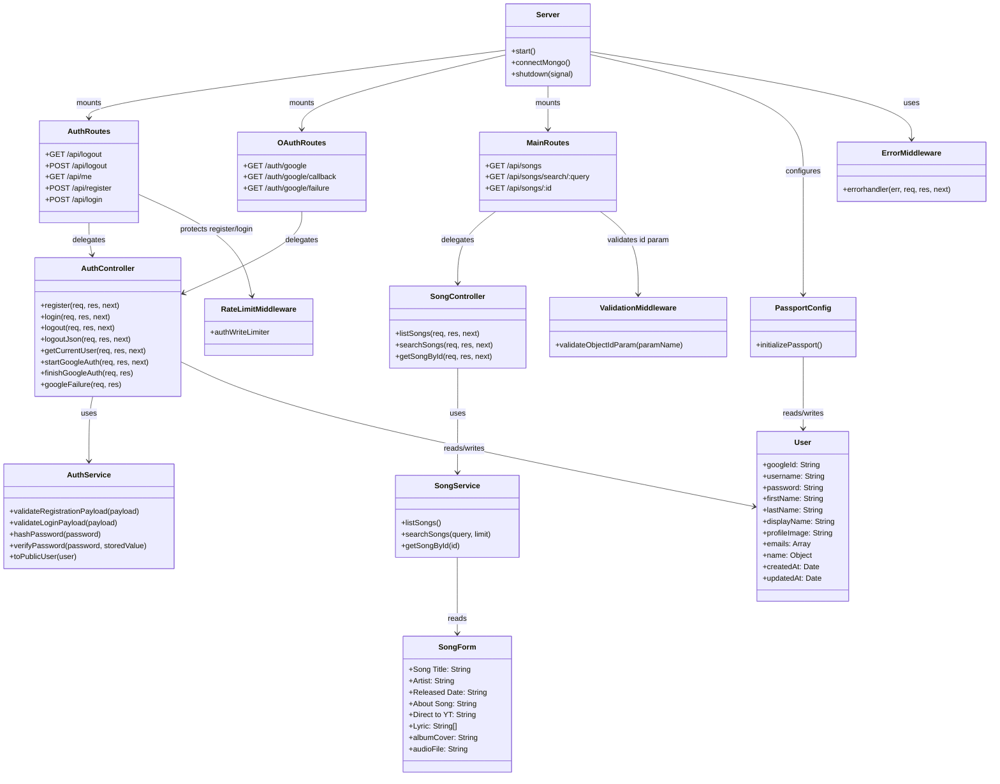

# Project Architecture UML

This diagram reflects the current Express + MongoDB application structure.

## Notes

- The main server entrypoint is `server.js`.
- Authentication is handled by `src/controllers/authController.js` and `src/services/authService.js`.
- Song data flows from `src/routes/main.js` → `src/controllers/songController.js` → `src/services/songService.js` → `src/models/songform.js`.
- OAuth is configured in `config/passport.js` and exposed under `/auth/google` routes.
- The code structure is generally clean, with route/controllers/services/models separated clearly.
- One minor consistency note: `package.json` sets `main` to `index.js` while the actual server entrypoint is `server.js`.
